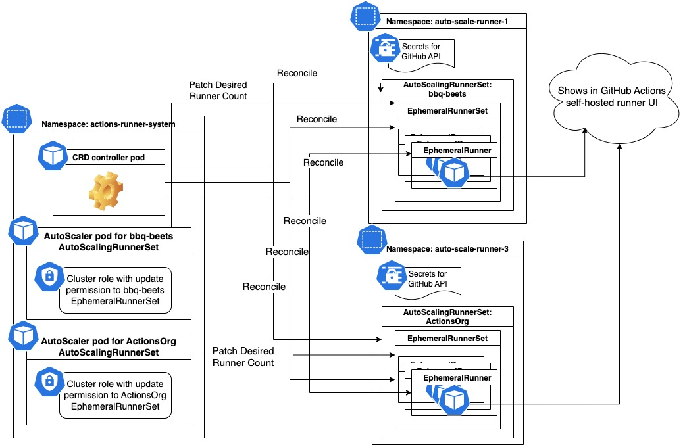

# ADR 0002: Actions-Runner-Controller Phase 1 Design (2022)

**Date**: 2022-10-20

**Status**: Pending

## Context

Pre-req reading about how we get here can be found in the following [RunnerScaleSet ADR](https://github.com/github/c2c-actions-runtime/blob/main/adrs/1709-first-class-autoscale-runnerset.md)

Epics:
- https://github.com/github/c2c-actions/issues/5598
- https://github.com/github/c2c-actions/issues/5599
- https://github.com/github/c2c-actions/issues/5640
- https://github.com/github/c2c-actions/issues/5638
- https://github.com/github/c2c-actions/issues/5641

In this ADR, I am going to go over the expected ARC deliverable for the end of 2022 (Q2), include the acquisition process with helm chart and the new CRD of ARC.

## ARC Acquisition Process

ARC is built on top of [Kubernetes' custom resource definition (CRD)](https://kubernetes.io/docs/concepts/extend-kubernetes/api-extension/custom-resources/) to extend the core resources (Deployment, Pod, Job, etc) that Kubernetes provides.

A custom resource is composed of 2 parts:
- A Yaml file that defines the schema of the custom resource (think as a REST API contract in a normal web app, adheres to OpenAPI spec)
- A controller binary that is deployed as a container which includes the business logic to handle reconciliation of your custom resources (Think of it as the binary code that handles certain operations of the REST API in a normal web app)

Due to the nature of CRD, the acquisition process are normally divided into 2 phases:
- Install the CRD into your Kubernetes cluster, so your cluster understands what to do when someone deploy an instance of the custom  resource.
- Deploy instances of the custom resource to utilize the functionally your CRD provides.

Using the current ARC as an example, here are the official docs from ARC for the acquisition process.
- Install CRD: 
   - via [helm chart](https://github.com/actions-runner-controller/actions-runner-controller/blob/master/README.md#install-helm-chart) 
   > `helm upgrade --install --namespace actions-runner-system --create-namespace actions-runner-controller actions-runner-controller/actions-runner-controller`
   - or via [kubectl](https://github.com/actions-runner-controller/actions-runner-controller/blob/master/README.md#deploy-arc)
   > kubectl apply -f https://github.com/actions-runner-controller/actions-runner-controller/releases/download/v0.22.0/actions-runner-controller.yaml

- Deploy an instance of the custom resource ARC provides use [`kubectl`](https://github.com/actions-runner-controller/actions-runner-controller#deploy-and-configure-arc):
```yaml
cat <<EOF | kubectl apply -f -
apiVersion: actions.summerwind.dev/v1alpha1
kind: RunnerDeployment  ## Custom resource provided by ARC CRD just installed
metadata:
  name: example-runnerdeploy
spec:
  replicas: 1 ## Create only 1 self-hosted runner statically, no auto-scale by default
  template:
    spec:
      repository: mumoshu/actions-runner-controller-ci ## Where the self-hosted runner will get configured to  
EOF
```

Once you have finished these steps, you should be able to see a self-hosted runner named `example-runnerdeploy-7XKO93` in the `Settings/Actions/Runners` of your repository `mumoshu/actions-runner-controller-ci`.

**Acquisition process for the new ARC**

Unify tooling to `helm chart` for both install CRD and deploy resource for the following reasons:
- Customers with less confident with Kubernetes don't have to due with Kubernetes YAML when they just want to try out the product.
- We want to expose the raw `Pod` template on the new ARC CRD so advanced customers can take full control over the `Pod` that has the self-hosted runner. We will use the `values.yaml` of our `helm chart` to provide the right default `Pod` template for each well-known scenarios (DinD, Container Hook).
> For contrast: Current ARC construct the `Pod` template under the custom resource layer (via golang code) and expose sub-config of `Pod` pice by pice base on user requests. This means any change would require a newer version of the ARC CRD (Yaml + container). Well, in our `helm chart` model we just need to publish a newer version of the `helm chart` which is much cheaper.

We will have 2 helm charts:
- actions-runner-controller (install the CRD and the controller, which ARC already has)
- auto-scaling-runner-set (deploy an auto-scale runner using the ARC CRD)

New flow:
- Install CRD via Helm:  
  ```sh
  helm install --namespace actions-runner-system\
   --create-namespace\
   --wait actions-runner-controller\
   actions-runner-controller/actions-runner-controller ## chart for CRD and its controller
  ```
- Deploy an instance of the custom resource ARC provides via Helm:  
  ```sh
  helm install --namespace auto-scale-runner\
   --create-namespace\
   --set=githubConfigUrl=https://github.com/actions\
   --set=gitHubConfigSecret.github_token=xxxx\
   --set=dindEnabled=true\ ## indicate setup DinD sidecar container inside the runner pod
   --wait test-auto-scale-runners\
   actions-runner-controller/auto-scaling-runner-set ## chart for deploy AutoScalingRunnerSet
  ```
- Change an existing deployed resource via Helm:
  ```sh
  helm upgrade --namespace auto-scale-runner\
   --reuse-values\ ## reuse existing value on the installed release
   --set=gitHubConfigSecret.github_token=gh_xxxx\ ## update the PAT to use
   --wait test-auto-scale-runners\
   actions-runner-controller/auto-scaling-runner-set ## chart for deploy AutoScalingRunnerSet
  ```

## ARC custom resource definitions

We has basically decided our CRD via https://github.com/github/c2c-actions-runtime/discussions/2024

Here is the recap:

We will introduce 3 new custom resources:
- AutoscalingRunnerSet (user facing)
- EphemeralRunnerSet (internal)
- EphemeralRunner (internal)

### CRD for AutoscalingRunnerSet

```yaml
apiVersion: actions.github.com/v1alpha1  ## move away from summerwind namespace
kind: AutoscalingRunnerSet
metadata:
  ## This will also be the name for the RunnerScaleSet show in the UI on GitHub.
  ## The name will also be added as a Label to the RunnerScaleSet.
  ## So you can `runs-on: example-auto-scale-runner-set`
  name: example-auto-scale-runner-set 

  ## we recommend that each AutoscalingRunnerSet get deployed
  ## into its own namespace for better security isolation and resource management.
  namespace: actions-runner-system
spec:
    ## Required, similar to the runner config url
    gitHubConfigUrl: https://github.com/github/github
    ## Required, name to a K8s secretRef, the secret.data may contains multiple info, ex: PAT or GitHub App Installation
    gitHubAuthSecret: githubCreds
    ## Required, this will be the RAW corev1.PodTemplateSpec for the runner
    template:
      metadata:
        labels:
          environment: production
        annotations:
          platform: aws
      spec:
        containers:
        ## We will require you have to provide a container that has name `runner`
        - name: runner
          image: huangtingluo/jit-runner-image:latest
    ## Optional, runner group name for this auto scale runner set, the default runner group will be use when user not provide the input.
    runnerGroup: default
    ## Optional 
    maxRunners: 10
    ## Optional
    minRunners: 5
    ## Optional proxy server for both the listener and the runner container.
    proxy: 
       http:
          url: http://10.0.0.1:9090
          credentials: proxyCredRef
       https: 
          url: http://10.0.0.1:9090
          cred: proxyCredRef
       noproxy:
        - "localhost"
        - "127.0.0.1"
    ## Optional configMap for self-sign SSL cert CA file, needed for both the runner and the listener in GHES.
    tlsConfiguration:
      certConfigMapRef: selfSignCA
```

### CRD for EphemeralRunner
```yaml
apiVersion: actions.github.com/v1alpha1 ## move away from summerwind namespace
kind: EphemeralRunner
metadata:
  ## Generated via the root AutoscalingRunnerSet name
  name: example-auto-scale-runner-set-ephemeral-runner-XPOEDN

  ## Inherit from the root AutoscalingRunnerSet namespace 
  namespace: actions-runner-system
spec:
    ## Required, similar to the runner config url, inherit from the root AutoscalingRunnerSet spec
    gitHubConfigUrl: https://github.com/github/github
    ## Required, name to a K8s secretRef, the secret.data may contains multiple info, ex: PAT or GitHub App Installation
    ## Inherit from the root AutoscalingRunnerSet spec
    gitHubAuthSecret: github-creds
    ## Required, name of the RunnerScaleSet, inherit from the root AutoscalingRunnerSet name
    runnerScaleSet: example-auto-scale-runner-set
    ## Required, this will be the RAW corev1.PodTemplateSpec for the runner, inherit from the root AutoscalingRunnerSet spec
    template:
      metadata:
        labels:
          environment: production
        annotations:
          platform: aws
      spec:
        containers:
        ## We will require you have to provide a container that has name `runner`
        - name: runner
          image: huangtingluo/jit-runner-image:latest

    ## Optional proxy server for both the listener and the runner container.
    ## Inherit from the root AutoscalingRunnerSet spec
    proxy: 
       http:
          url: http://10.0.0.1:9090
          credentials: proxyCredRef
       https: 
          url: http://10.0.0.1:9090
          cred: proxyCredRef
       noproxy:
        - "localhost"
        - "127.0.0.1"
    ## Optional configMap for self-sign SSL cert CA file, needed for both the runner and the listener in GHES.
    ## Inherit from the root AutoscalingRunnerSet spec
    gitHubServerTLS:
      certConfigMapRef: selfSignCA
```

### CRD for EphemeralRunnerSet
```yaml
apiVersion: actions.github.com/v1alpha1 ## move away from summerwind namespace
kind: EphemeralRunnerSet
metadata:
  ## Generated via the root AutoscalingRunnerSet name
  name: example-auto-scale-runner-set-ephemeral-runner-set-AXOER

  ## Inherit from the root AutoscalingRunnerSet namespace 
  namespace: actions-runner-system
spec:
    ## Required, number of non-terminating EphemeralRunner expect to have
    ## The auto-scaler app (defined in `AutoscalingRunnerSet.spec.autoScalerPodTemplate`)
    ## is going to update this number to achieve both scale up and down
    desiredRunners: 5

    ## Required, construct by the root AutoscalingRunnerSet spec
    ephemeralRunnerSpec: EphemeralRunner.spec{}
```

## Helm chart for ARC

We will keep the current chart `actions-runner-controller/actions-runner-controller` for install/upgrade the ARC CRD.

We will introduce a new helm chart `actions-runner-controller/auto-scaling-runner-set` for customers to deploy an `AutoScalingRunnerSet` into their cluster which is using the new CRD we added.

The `values.yaml` file of our chart will help provide default value and eventually translate to an `AutoScalingRunnerSet` custom resource.

```yaml
## githubConfigUrl is the GitHub url for where you want to configure runners
## ex: https://github.com/myorg/myrepo or https://github.com/myorg
githubConfigUrl: "https://github.com/bbq-beets/ting-test"

## gitHubConfigSecret is the k8s secrets to use when auth with GitHub API.
## You can choose to use GitHub App or a PAT token
gitHubConfigSecret:
  ### GitHub Apps Configuration
  ## NOTE: IDs MUST be strings, use quotes
  #github_app_id: ""
  #github_app_installation_id: ""
  #github_app_private_key: |

  ### GitHub PAT Configuration
  #github_token: ""

## maxRunners is the max number of runners the auto scaling runner set will scale up to.
maxRunners: 5

## minRunners is the min number of runners the auto scaling runner set will scale down to.
minRunners: 0

## template is the PodTemplateSpec for each runner Pod
template:
  spec:
    containers:
    - name: runner
      image: huangtingluo/jit-runner-image:latest

## optional container mode to setup for the runner pod in case your workflow job use job container, service containers and container action.
containerMode:
  type: dind/kubernetes
  ## containerMode.type=dind will populate the runnerPodTemplate with following pod spec
  ## runnerPodTemplate
  ##   initContainers:
  ##     - name: initExternalsInternalVolume
  ##       image: huangtingluo/jit-runner-image:latest
  ##       command: ["cp", "-r", "-v", "/actions-runner/externals/.", "/actions-runner/tmpDir/"]
  ##       volumeMounts:
  ##         - name: externalsInternal
  ##           mountPath: /actions-runner/tmpDir
  ##   containers:
  ##     - name: runner
  ##       image: huangtingluo/jit-runner-image:latest
  ##       env:
  ##         - name: DOCKER_HOST
  ##           value: tcp://localhost:2376
  ##         - name: DOCKER_TLS_VERIFY
  ##           value: "1"
  ##         - name: DOCKER_CERT_PATH
  ##           value: /certs/client
  ##       volumeMounts:
  ##         - name: workingDirectoryInternal
  ##           mountPath: /actions-runner/_work
  ##         - name: dinDInternal
  ##           mountPath: /certs/client
  ##           readOnly: true
  ##     - name: dind
  ##       image: docker:dind
  ##       securityContext:
  ##         privileged: true
  ##       volumeMounts:
  ##         - mountPath: /certs/client
  ##           name: dinDInternal
  ##         - mountPath: /actions-runner/_work
  ##           name: workingDirectoryInternal
  ##         - mountPath: /actions-runner/externals
  ##           name: externalsInternal
  ##   volumes:
  ##     - name: dinDInternal
  ##       emptyDir: {}
  ##     - name: workingDirectoryInternal
  ##       emptyDir: {}
  ##     - name: externalsInternal
  ##       emptyDir: {}
  
  ## containerMode.type=kubernetes will populate the runnerPodTemplate with following pod spec
  ## runnerPodTemplate
  ##   containers:
  ##     - name: runner
  ##       image: huangtingluo/jit-runner-image:latest
  ##       env:
  ##         - name: ACTIONS_RUNNER_CONTAINER_HOOKS
  ##           value: /actions-runner/k8s/index.js
  ##         - name: ACTIONS_RUNNER_POD_NAME
  ##           valueFrom:
  ##             fieldRef:
  ##               fieldPath: metadata.name
  ##         - name: ACTIONS_RUNNER_REQUIRE_JOB_CONTAINER
  ##           value: "true"
  ##       volumeMounts:
  ##         - name: work
  ##           mountPath: /actions-runner/_work
  ##   volumes:
  ##       - name: work
  ##         ephemeral:
  ##           volumeClaimTemplate:
  ##             spec:
  ##               accessModes: [ "ReadWriteOnce" ]
  ##               storageClassName: "local-path"
  ##               resources:
  ##                 requests:
  ##                   storage: 1Gi
  
  ## required when containerMode.type=kubernetes
  kubernetesModeWorkVolumeClaim:
    accessModes: ["ReadWriteOnce"]
    storageClassName: "dynamic-blob-storage"
    resources:
      requests:
        storage: 1Gi
```

## Security Enhancements in ARC

The security topic is mainly about which custom resource will get access to the GitHub Admin token that has permission to configure self-hosted runner.

In the current ARC, there are 2 kind of `pod`:
- ARC controller pod, normally a singleton per cluster, it has access to GitHub Admin token
- Runner pod, pod with the self-hosted runner container in it. The runner container will handle runner configuration itself, so it also has access to the GitHub Admin token, normally lots of these pod and base on auto-scale the number of runner `pod` may go up and down.

No matter how you put these resources into different namespaces with different service accounts, they both have access to the GitHub Admin token. This is bad since we don't want to have any workflow job (no matter trust or not) with the ability of configuring self-hosted runner based on some information left on the container.

In the newer version of ARC, we will make sure the runner pod don't have access to GitHub Admin token by default.
The newer version of ARC will have 3 kind of `pod`:
- ARC controller pod, normally a singleton per cluster, it has access to the GitHub Admin token since it will handle runner registration.
- Auto-scaler pod, one per `AutoscalingRunnerSet` deployment, it will live inside the namespace of the ARC controller pod. It has access to the GitHub Admin token since it will handle communication with Actions service RunnerScaleSet API which require admin permission.
- Runner pod will not have access to any GitHub Admin token, the runner container will start with a configured runner config/cred and good to listen to job from Actions service.

There will be 3 service accounts involved in the new ARC.

Let's assume the ARC CRD is deployed into namespace `actions-runner-system` and `AutoscalingRunnerSet` is deployed into namespace `actions-runner-example`.

- ARC controller pod (actions-runner-system), service account will be a `ClusterRole` and has permission to create/update/delete most resource in all namespaces
- Auto-scaler pod of the AutoscalingRunnerSet (actions-runner-system), service account will be a `ClusterRole` and only has permission to create/update/delete `EphemeralRunnerSet` resource in namespace `actions-runner-example`.
- Runner pod (actions-runner-example), service account will be a `Role` and only have permission to create/update/delete pod resource in namespace `actions-runner-example`.

All service accounts will be provisioned as part of the helm chart installation.



## New runner images for ARC

We will only ship a runner image that is optimized for smaller size by the end of 2022 Q2.

- The image will based of `mcr.microsoft.com/dotnet/runtime-deps:6.0 (debian based)`
- It will have a runner binary under `/actions-runner` (`/actions-runner/run.sh` exists)
- The `WORKDIR` is set to `/actions-runner`
- The ENV `RUNNER_ALLOW_RUNASROOT` set to `1`

The existing ARC runner images will not working with the new ARC mode out-of-box for the following reason:
- The current runner image require to pass runner configure info, ex: URL and Config Token
- The current runner image has the runner binary under `/runner`
- The current runner image requires a special entrypoint script in order to workaround some volume mount limitation for setting up DinD.

However, since we expose the raw runner Pod spec to our customer, advanced user can modify the helm `values.yaml` to make everything lines up properly.

## ARC Upgrade process

Due to the nature of the Kubernetes CRD, upgrading story for ARC normally contains 3 parts:
- The CRD YAML schema change, ex: new input to support new functionality
- The CRD controller container image update, ex: bug fix or feature change via golang code.
- Handle compatibility with existing resource version in the cluster.

Here is the full upgrade doc for current ARC: https://github.com/actions-runner-controller/actions-runner-controller/blob/master/charts/actions-runner-controller/docs/UPGRADING.md#upgrading

Some highlights:
- The current ARC does not version its custom resource, it's always at `v1alpha1`, it's developer's resoposbility to make sure any CRD change is back compatible. 
- Due to the helm chart limitation, CRD upgrade has to be done via `kubectl`
- The upgrade process upgrade the CRD first and then upgrade the CRD controller container.
- The current ARC supports upgrade while there are deployed resource running.

Since we moved most of the Pod spec construction from custom resource layer to the helm chart layer, we should be able to reduce the number release we have to do for the ARC CRD, instead, most of the update will come to the helm chart we published.

In other word, we expect customer to run `helm upgrade test-auto-scale-runners actions-runner-controller/auto-scaling-runner-set` much more frequently compare to `helm upgrade actions-runner-controller actions-runner-controller/actions-runner-controller`

